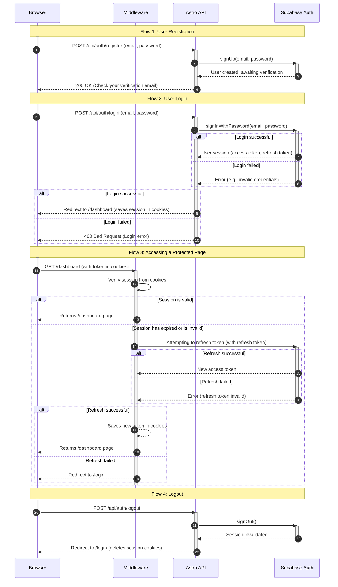

<authentication_analysis>

### 1. Authentication Flows

Based on the provided documentation, the following authentication flows have been identified:

- **User Registration:** A new user creates an account by providing an email address and password. After successful validation, a verification link is sent to the email address.
- **Email Address Verification:** The user clicks the verification link, which activates their account and allows them to log in.
- **User Login:** A registered and verified user logs in using their credentials. Upon successful login, the system creates a session and saves tokens in cookies.
- **User Logout:** A logged-in user ends their session. The system removes the tokens from the cookies.
- **Password Recovery:** A user who has forgotten their password can request a reset link to be sent to their email address.
- **Password Reset:** The user sets a new password after clicking the reset link.
- **Resource Access Protection:** Middleware checks the user's session with every attempt to access protected resources. If there is no session, the user is redirected to the login page.
- **Token Refresh:** The Supabase SSR library automatically manages the refreshing of the access token using the refresh token to maintain session continuity without requiring re-login.

### 2. Main Actors and Their Interactions

- **Browser:** Represents the client (user) interacting with the application. It initiates requests for registration, login, resource access, etc.
- **Astro Middleware:** Acts as a server-side intermediary layer. It intercepts every request, verifies the user's session based on cookies, and decides whether to grant access or redirect.
- **Astro API:** A set of server-side API endpoints that handle business logic, such as registration, login, or logout. It communicates directly with Supabase Auth.
- **Supabase Auth:** An external service responsible for managing user identities, including account creation, authentication, and generating and verifying JWTs.

### 3. Token Verification and Refresh Processes

- **Verification:** For every request to a protected route, the middleware uses the Supabase SSR library to read tokens from HTTP-only cookies. It then verifies the validity of the access token. If it is invalid or has expired, it attempts to refresh it.
- **Refreshing:** If the access token has expired but the refresh token is still valid, the Supabase SSR library automatically sends a request to Supabase Auth to obtain a new access token. The new token is then saved in the cookies, and the user's request is continued. If the refresh token has also expired, the user is logged out and must log in again.

### 4. Description of Authentication Steps

- **Registration:** User fills out the form in the `Browser` -> `Astro API` validates the data and calls `Supabase Auth` -> `Supabase Auth` creates the user and sends a verification email.
- **Login:** User sends login credentials from the `Browser` -> `Astro API` forwards them to `Supabase Auth` -> `Supabase Auth` verifies the credentials and, if correct, returns tokens that `Astro API` saves in secure cookies.
- **Accessing a Protected Page:** User sends a request from the `Browser` -> `Middleware` intercepts the request, verifies the token from the cookies -> If the token is valid, it grants access. If not, it redirects to the login page.
- **Logout:** User clicks the logout button in the `Browser` -> `Astro API` calls `Supabase Auth` to invalidate the session and clears the cookies.
  </authentication_analysis>

<mermaid_diagram>

</mermaid_diagram>
